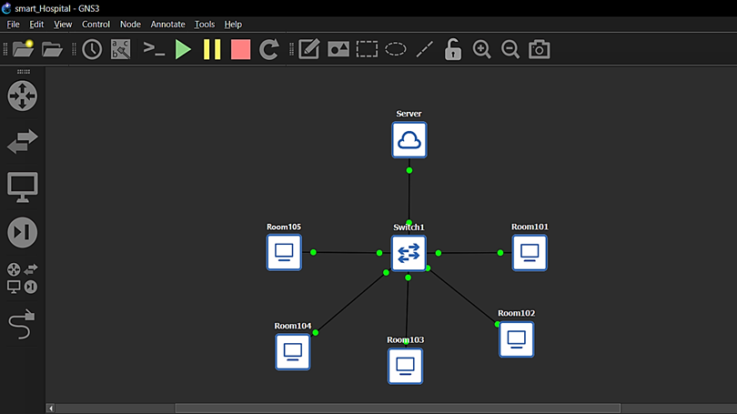
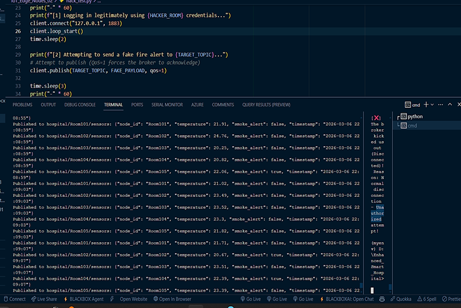
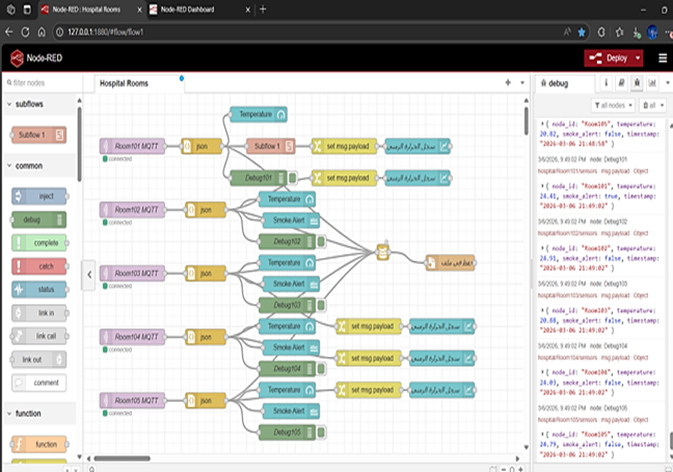
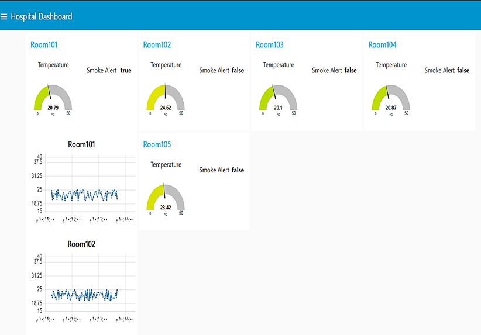
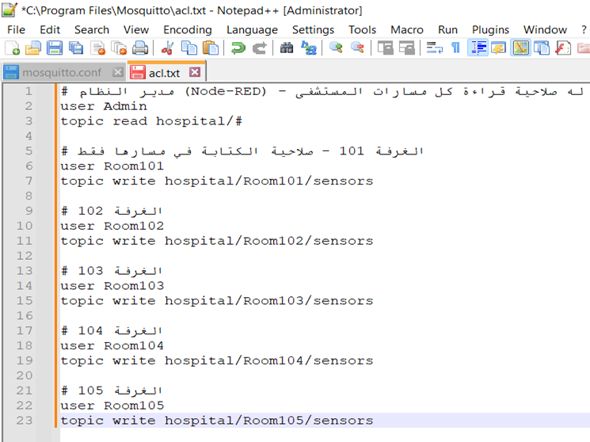
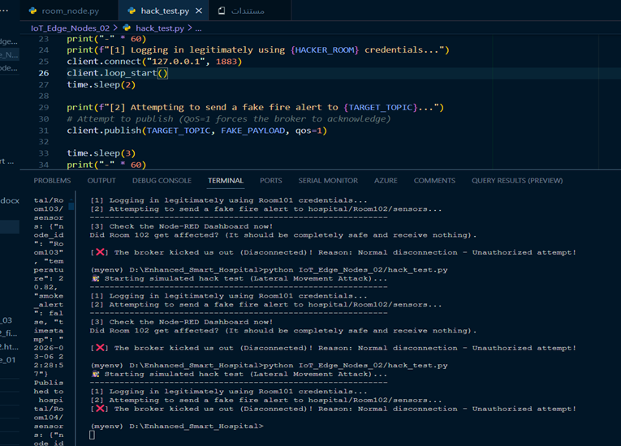
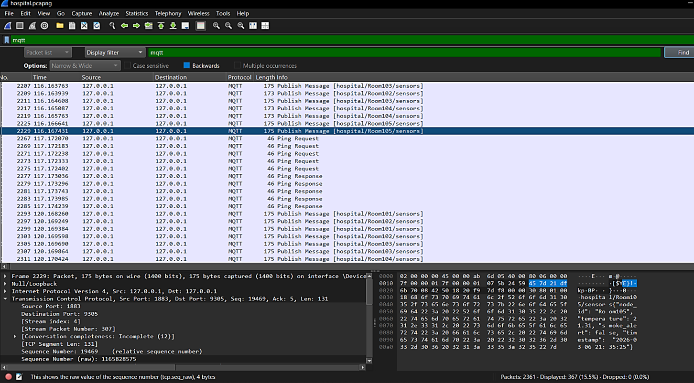

---
# 🏥 Enhanced Smart Hospital IoT Monitoring System

An advanced, secure, and real-time Industrial IoT (IIoT) solution designed for monitoring modern hospital environments. Built on a **Zero Trust Architecture**, this system ensures strict patient data privacy, absolute network isolation, and resilient defense against identity spoofing attacks.

---

## 📋 Project Overview
In critical healthcare facilities, real-time environmental visibility is non-negotiable. This project implements a comprehensive monitoring framework simulating **5 independent hospital rooms** equipped with **Temperature** and **Smoke/Fire Detection** capabilities. 

The core engineering objective is to bridge the gap between virtualized enterprise network infrastructure (**GNS3 / VMware**) and lightweight messaging protocols (**MQTT**), backed by rigorous cybersecurity enforcement using **Access Control Lists (ACL)** and protocol verification via **Wireshark**.

---

## 🏗️ System Architecture (The 5-Layer Framework)

The system’s design is strictly modular, organized into a decoupled 5-layer architecture to maximize scalability and fault tolerance:

1. **Sensor Simulation Layer (Edge Nodes):** Multithreaded Python scripts simulating independent microcontrollers. Each node encapsulates local sensor trends and internal health telemetry.
2. **Communication Layer (Transport):** A centralized, high-throughput **Mosquitto MQTT Broker** acting as the message distribution hub.
3. **Security & Identity Layer (Enforcement):** Strict client authentication combined with topic-level **ACL policies** to prevent cross-room data leakage.
4. **Processing Layer (Middleware/Logic):** **Node-RED** workspace running custom runtime logic, data extraction, and rule-based parsing.
5. **Visualization Layer (UI/UX):** An interactive, low-latency web dashboard providing medical and technical staff with real-time analytics and dynamic threshold alerts.

### 🌐 Network & System Topology
The entire setup is simulated over a virtualized production network. Below is the comprehensive topology mapping the logical placement of edge endpoints, the central broker, the management console, and packet sniffing interfaces:


*Figure 1: Comprehensive Network Architecture and Node Topology inside GNS3.*

---

## 💻 Technical Implementation Details

### 1. Python Edge Nodes & Data Stream
Each room operates an independent Python node powered by the `paho-mqtt` client library. The script samples environmental data, converts it into structured JSON payloads, and streams it asynchronously every 4 seconds.

* **Payload Format:** `{"Room": 101, "Temperature": 24.5, "Smoke_Alarm": 0}`


*Figure 2: Execution of multithreaded Python sensor nodes and continuous JSON telemetry streaming.*

### 2. Node-RED Core Logic Workspace
Node-RED ingests raw payloads from subscribed MQTT topics. It extracts specific parameters, triggers immediate logic decisions (e.g., sound fire alarm if `Smoke_Alarm == 1`), and maps numbers seamlessly into visualization nodes.


*Figure 3: Node-RED processing pipeline showing structured flows, interconnecting wires, and active debug messages.*

### 3. Real-time Monitoring Dashboard
The medical console provides dynamic real-time tracking. Color-coded gauges change behavior under critical thresholds, and history charts display continuous environmental conditions across all 5 wards.


*Figure 4: Production-grade real-time interactive medical monitoring dashboard.*

---

## 🛡️ Cybersecurity & Zero Trust Framework

### 1. Access Control Lists (ACL) Setup
To enforce strict data privacy, the network follows a **Zero Trust** model. Implicit trust is eliminated. A compromised node in Room 101 must never be able to view or corrupt data in Room 102. This is implemented via a strict, server-side `acl.txt` configuration on the Mosquitto broker, locking down read/write privileges per user.


*Figure 5: Access Control Lists (ACL) profile enforcing explicit topic isolation on the MQTT Broker.*

### 2. Penetration Testing & Spoofing Mitigation
To test system resilience, a rogue script (`hack_test.py`) was introduced to mimic an insider threat attempting to inject a fake fire alarm into another room. Thanks to the ACL firewall, the broker immediately blocks the malicious message, drops the unauthorized connection, and shields the dashboard from fake alerts.


*Figure 6: Automated blocking and total evasion of an unauthorized injection attack.*

### 3. Wireshark Network Packet Analysis
Deep packet inspection was carried out to capture network data frames. Wireshark analysis logs confirm that raw connection requests are monitored and unauthorized subscription queries are cleanly dropped without disclosing critical backend topic hierarchies to the adversary.


*Figure 7: Protocol verification and cryptographic telemetry mapping using Wireshark.*

---

## 📁 Repository Structure

```text
├── IoT_Edge_Nodes_02/          # Multi-client Python scripts for sensor simulation & exploit scripts
├── Logic_and_Dashboard_03/     # Node-RED flow configuration files and Mosquitto broker rules
├── Database_Logs_04/           # Archived CSV data captures and raw Wireshark network logs (.pcapng)
├── Documentaion_05/            # Technical engineering blueprints, project slides, and high-res system figures
└── instructions.txt           # Environment deployment and quickstart execution guidelines

```

---

## 👨‍🔬 Author

**Engineer Fares Al-Selwi** *Electrical Engineering - Faculty of Engineering, Sana'a University*

